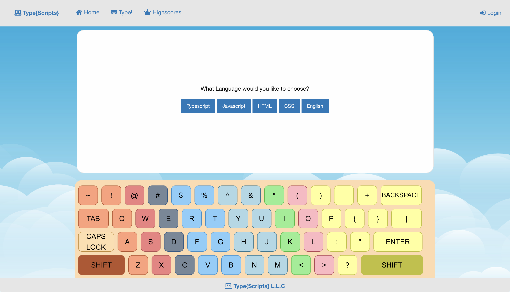

# TYPESCRIPTS

## Objective
Build an application where the user is able to practice their typing speed and accuracy while learning/practicing coding languages at the same time. In the current build, the user is able to practice, Typescripts, Javascript, HTML, CSS, and plain english.

### Typing Demo:

  ## Table of Contents 
- [Objective](#objective)
- [License](#license)
- [Description](#description)
- [Deployment](#deployment)
- [Githubs](#githubs)

## License

## Description

TypeScripts is a typing game for all developers, new and experienced alike; where users are able to see their typing skills when typing code. We noticed that a lot of the typing quizes or games didn't offer developer modes where you can type code instead of random words and sentences and sought to provide a solution in the form of TypeSCripts. This being our very first full stack development project, we learned a lot about technical skills and social skills when working in a team.

# Deployment

https://typescripts-btc.herokuapp.com/

### Built With

* [HTML](https://developer.mozilla.org/en-US/docs/Web/HTML)
* [CSS](https://developer.mozilla.org/en-US/docs/Web/CSS)
* [Javascript](https://developer.mozilla.org/en-US/docs/Web/JavaScript)
* [Node.js](https://nodejs.org/en/)
* [Handlebars](https://handlebarsjs.com/)
* [DOTENV](https://www.npmjs.com/package/dotenv)
* [bcrypt](https://www.npmjs.com/package/bcrypt)
* [Express](https://www.npmjs.com/package/express)
* [Sequelize](https://sequelize.org/)

## Authors

Contributors names and contact info:

* [Kamyar](https://github.com/Kam-Mivehchi)
* [Omar](https://github.com/OmarAce)
* [Nick](https://github.com/nicholasamarillo)
* [Runa](https://github.com/runaariga)
